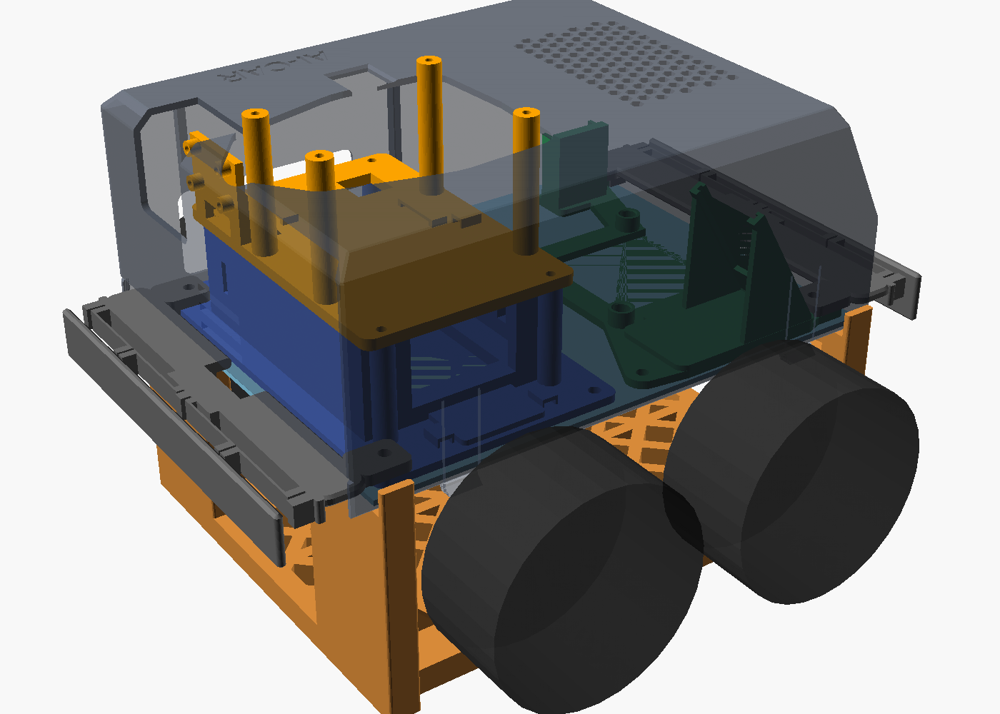
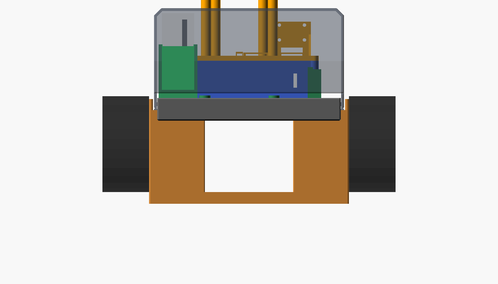
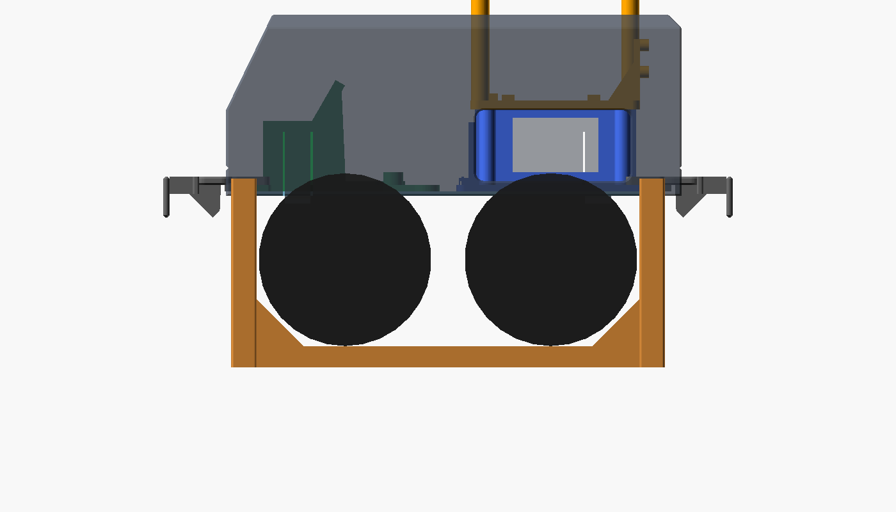
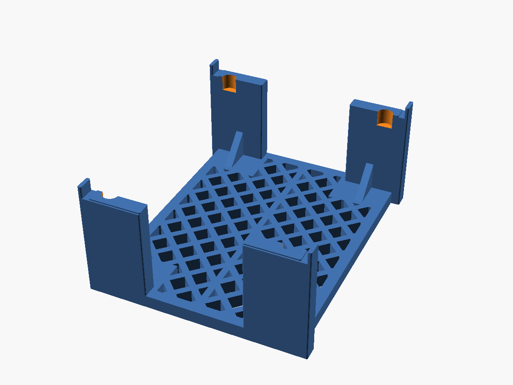
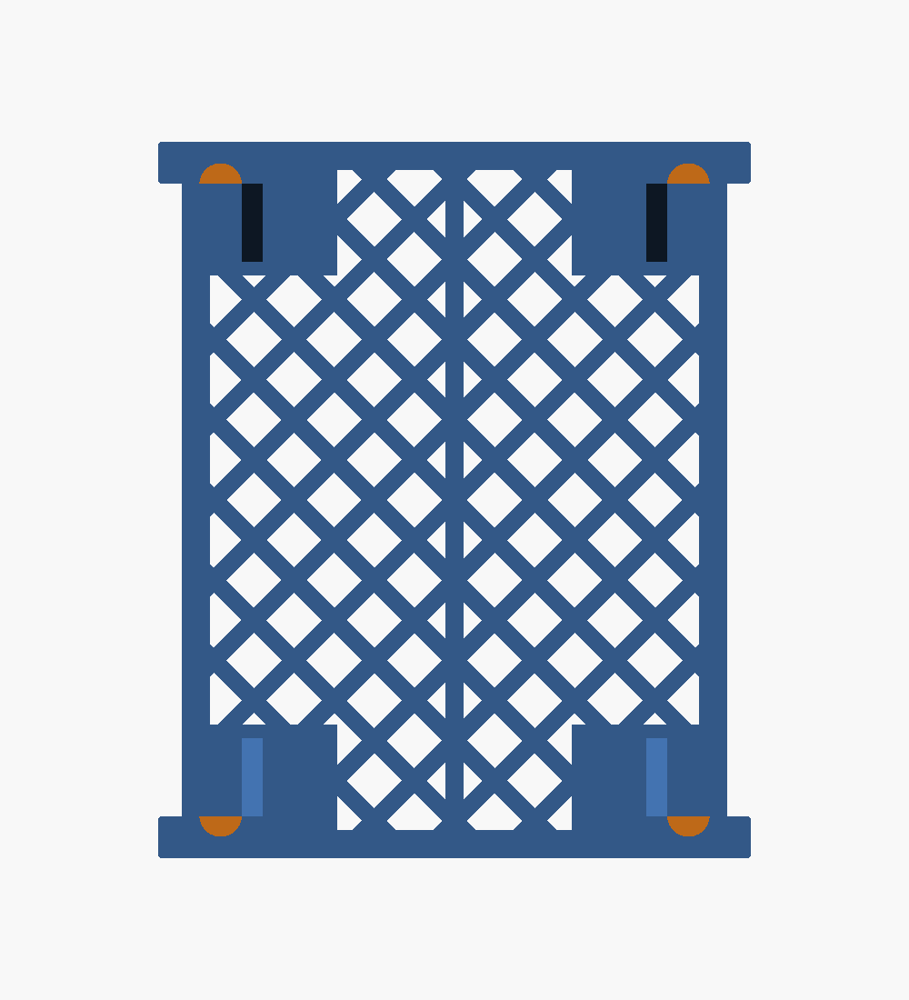

# AI-CAR 試験台（test_stand）

車体を載せて車輪を床から浮かせ、モーター・エンコーダー・センサーを走らせずに試すための台です。

- カバーとバンパーを付けたまま載せられます
- 天板の 4 隅の下面（左右 40 mm × 前後 10.7 mm）で受けます。受け面は床から 80 mm（天板の下面の高さ。車輪が床に着いたときは約 70 mm なので、車輪は約 10 mm 浮きます）
- 車体とのすき間は 1 mm です。受け面の外側はカバーの左右の壁の下端（天板の下面の高さ）から 1 mm 下げ、左右の位置決めの壁はカバーの壁の外側から 1 mm あけています。バンパー・カバー・車輪（仮の寸法）とは 1 mm 以上離れています（OpenSCAD で確認）
- 4 隅の柱を厚さ 10 mm の床板でつないだ 1 個の部品です（167.4 × 202 × 88 mm。K1C の 220 × 220 mm に入る）
- 床板は中抜きです。外周の枠 8 mm、斜めの格子のリブ 5 mm（ピッチ 32 mm）と前後の中心線のリブで、ねじれと曲げに強くしています。柱の下は穴をあけず、柱の内側に三角の補強を付けています
- 車輪のある所（前後の端から 10.7〜93.3 mm）の床板は天板の幅までにして、車輪の下に入らないようにしています。床板の上面は浮いた車輪の下端とほぼ同じ高さです

| 載せた図 | 前から | 横から | 部品（印刷する向き） | 床板（真上から） |
|---|---|---|---|---|
|  |  |  |  |  |

ダッシュボードの 3D プリントタブでは、部品の「試験台」と「組み立て図（カバー付き・試験台）」で回して見られます。

## 印刷

- `test_stand.stl` × 1。床板を下にして、サポートなし
- PLA / PETG、壁 3 周、インフィル 20 % 程度

## 使い方

1. 平らな床に置きます
2. 車体を上から下ろし、左右の壁の間に入れて、天板の 4 隅を受け面に載せます
3. 前後方向は止めていません（摩擦だけ）。急な加減速のテストをするときは、手で押さえてください

## 注意

- 落下防止センサー（VL53L1X）を配線したあとは、台の上では床が遠くなるので「段差」と判定され、前進・後退が止まります。台の上で走らせるときは `cliff_guard` を切ってください
- 車輪の内側の面（カバーの壁の外側から 4 mm、`wheel_in`）は仮の値です（カップリングの長さが資料にない）。受け面と位置決めの壁は車輪より前後の外にあるので、この値では当たりは変わりません
- 受け面の天板の 4 隅の穴（Ø4.4、X 11 / 143 mm・Y 11 / 189 mm）の下に、Ø12 × 深さ 12 mm のくぼみを付け、上の部品を留めるネジの先・ナット（M4 のナットの角 8.1 mm）をよけています。ナットより大きいもの（スペーサーなど）が付いているときは `nut_d`・`nut_h` を直してください

## 車輪と車軸の寸法の出どころ

部品リスト（OSOYOO 520 エンコーダー付きモーター ×4、メカナムホイール ×4）の製品の資料から取りました（[OSOYOO FlexiRover 520 モーター版のページ](https://osoyoo.com/2024/08/26/osoyoo-flexirover-basic-robot-car-for-mega2560-running-520-motor-with-mecanum-wheel-model-2024007400/)にある図面）。

| 値 | 寸法 | 資料 |
|---|---|---|
| `wheel_d` / `wheel_w` | 直径 80.59 mm、幅 39.1 mm | メカナムホイールの外形図（`2019018100.jpg`） |
| `wheel_axle` | 天板の前後の端から 52 mm | シャーシ 1 段目の図面（`1st_layer.dwg`）で、モーターの台の穴 24 × 30 mm が Y 37 / 67 mm、X 12 / 36 mm。台（`2018003600.jpg`、幅 40 mm）の中心に軸がある。天板の上のモーター取付ネジの範囲（前後の端から 38〜66 mm）とも合う |
| `deck_floor` | 70 mm（実測のまま） | 図面からの計算では、軸は台の底から 27 mm 下、車輪の半径 40.3 mm なので 67.3 mm。実測と 2.7 mm 違うので、車輪は 10〜12.7 mm 浮く |

モーター（`2024005900.pdf`）は Ø37 × 長さ 72 mm、軸 Ø4（D カット）で、台の底から約 48 mm 下まで出ます。台は Y 32〜72 mm にあり、受け面（Y 10.7 mm まで）と三角の補強には当たりません。

## 作り直し

```bash
openscad -o test_stand.stl test_stand.scad
openscad -D 'part="view"' --projection=o --camera=77,100,-20,90,0,90,600 --imgsize=1400,800 --colorscheme=Tomorrow -o test_stand_side.png test_stand.scad
```

`battery_lidar_mount.scad` を `use` しているので、`part = "view"` ではカバー・バンパーなどの今の形と重ねて表示します。
