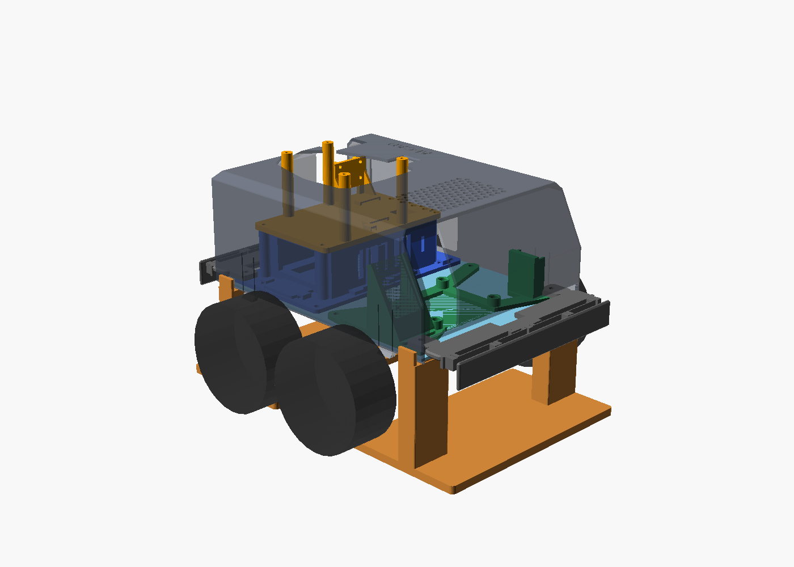
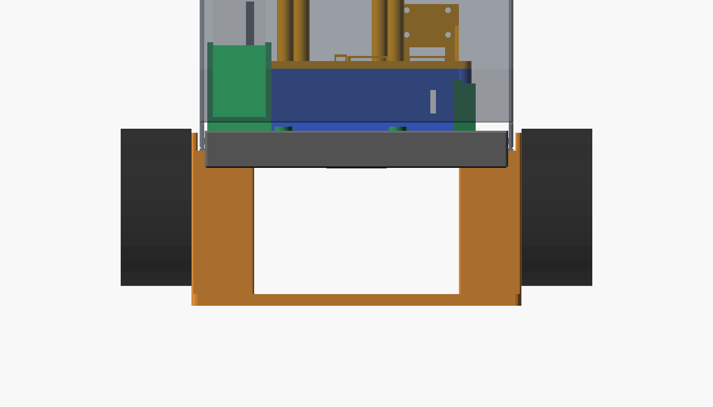
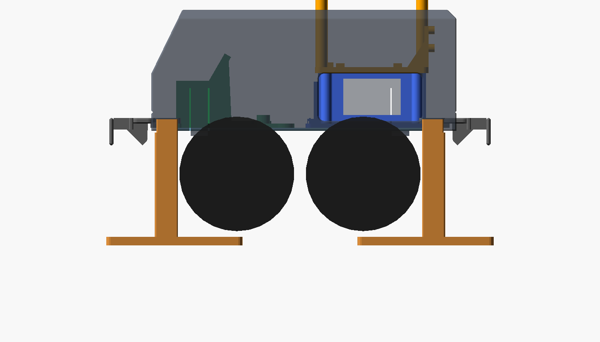
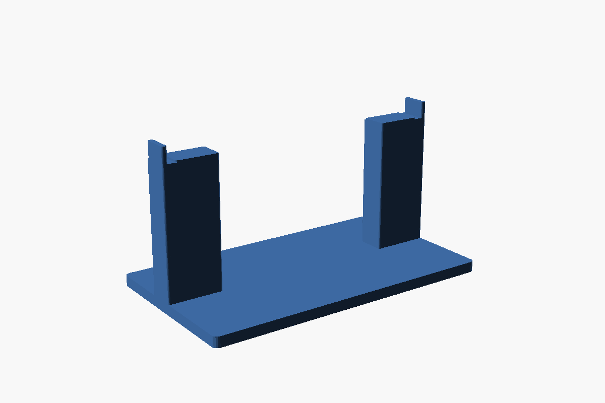

# AI-CAR 試験台（test_stand）

車体を載せて車輪を床から浮かせ、モーター・エンコーダー・センサーを走らせずに試すための台です。

- カバーとバンパーを付けたまま載せられます
- 天板の 4 隅の下面（左右 25 mm × 前後 15 mm）で受けます。受け面は床から 80 mm（天板の下面の高さ。車輪が床に着いたときは約 70 mm なので、車輪は約 10 mm 浮きます）
- 車体とのすき間は 1 mm です。受け面の外側はカバーの左右の壁の下端（天板の下面の高さ）から 1 mm 下げ、左右の位置決めの壁はカバーの壁の外側から 1 mm あけています。バンパーとは 1 mm 以上離れています（OpenSCAD で確認）
- 同じ部品を 2 個印刷し、前と後ろに置きます（後ろは 180° 回す）。1 個 167.4 × 95 × 88 mm（K1C の 220 × 220 mm に入る）
- 床の板は浮いた車輪の下（天板の端から 60 mm 内側）とバンパーの下（35 mm 外側）まで広げて、倒れにくくしています

| 載せた図 | 前から | 横から | 部品（印刷する向き） |
|---|---|---|---|
|  |  |  |  |

## 印刷

- `test_stand.stl` × 2。床の板を下にして、サポートなし
- PLA、インフィル 20 % 程度

## 使い方

1. 2 個を、前後の端が天板の前後の端の下に来るように置きます（間隔は約 170 mm）
2. 車体を上から下ろし、左右の壁の間に入れて、天板の 4 隅を受け面に載せます
3. 前後方向は止めていません（摩擦だけ）。急な加減速のテストをするときは、手で押さえてください

## 注意

- 落下防止センサー（VL53L1X）を配線したあとは、台の上では床が遠くなるので「段差」と判定され、前進・後退が止まります。台の上で走らせるときは `cliff_guard` を切ってください
- 車輪の直径（80 mm）と前後の位置（天板の端から車軸まで 56 mm）は仮の値です。車輪が大きい場合は、`wheel_d` を変えると受け面の奥行き（`pad_y`）が車輪の手前 1 mm までに縮みます
- 天板の 4 隅の下面に、ネジの頭・スペーサーなどが出ていないことを確かめてから載せてください（図面にはありません）

## 作り直し

```bash
openscad -o test_stand.stl test_stand.scad
openscad -D 'part="view"' --projection=o --camera=77,100,-20,90,0,90,600 --imgsize=1400,800 --colorscheme=Tomorrow -o side.png test_stand.scad
```

`battery_lidar_mount.scad` を `use` しているので、`part = "view"` ではカバー・バンパーなどの今の形と重ねて表示します。
